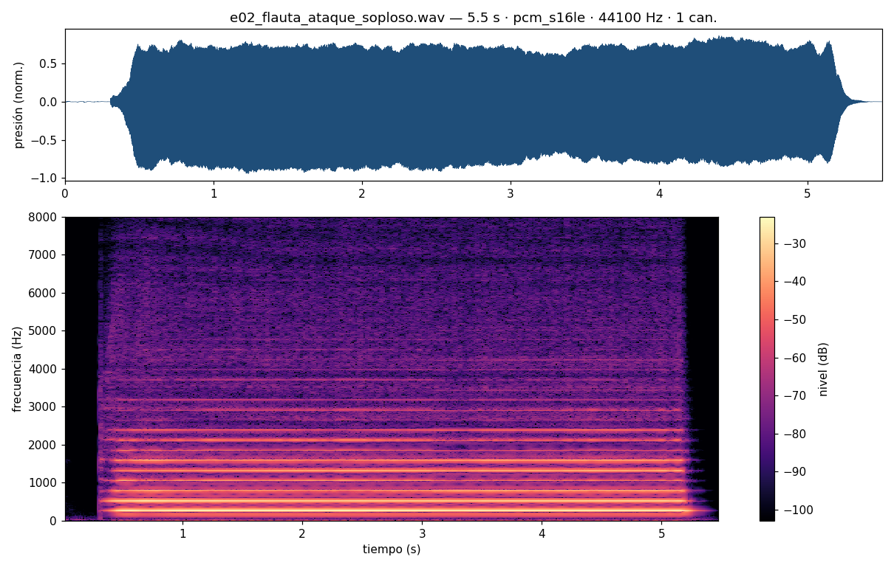

## Hoy {.center}

::: {.incremental}
- **Módulo 1**: el sonido dibujado — forma de onda y espectro
- **Módulo 2**: el sonido viaja — $v = \lambda f$ y el espectrograma
:::

. . .

Dos módulos, un hilo: **traducir** el sonido a imágenes que se puedan leer.

## Escucha del día — la práctica de cada semana

**Protocolo** (10′, sin nota):

::: {.incremental}
- Escuchan el estímulo, **dos pasadas**
- Anotan en 3 líneas: **describir → hipotetizar → verificar** (**2′**)
- Discuten en la mesa (**3′**): el vocero anota el diagnóstico del grupo
- Plenario (**3′**): el profesor pregunta a una o dos mesas — responde el vocero por el grupo — y cierra con su propia versión
:::

> La rúbrica OA3 es guía para autoevaluarse, no calificación: se usa así todas las semanas; se evalúa por escrito en s07, s13 y s15.

::: {.notes}
Estímulo: `e02_flauta_ataque_soploso.wav` (nota C4, ~5,5 s), dos pasadas.

**Si alguien dice "es una flauta, ¿qué más hay que decir?"**: nombrar la
fuente es el comienzo de la *descripción*, no la meta. Redirigir a la
estructura: aquí suenan DOS capas a la vez — una nota estable y un
"aire" continuo. Describir: ¿registro?, ¿el soplo dura toda la nota o
solo el inicio?, ¿parte antes de que la nota enganche? Hipotetizar es
proponer el **mecanismo**: ¿qué produce cada capa y qué relación
tienen? (la buena: el soplo es el chorro turbulento contra el bisel —
ruido de banda ancha — y la nota es la columna de aire resonando: el
tubo "elige" sus frecuencias de ese ruido). Verificar = cómo lo
comprobarían: espectrograma de esta misma nota (líneas parejas +
neblina entre líneas — hoy mismo pueden apuntar la app), comparar con
un silbido (casi sin capa de soplo), o soplar más fuerte con la misma
digitación (salta la octava).

**La "versión experta" del cierre** (~1′, después de los voceros; hoy
toca modelar el formato completo — es la primera): son las MISMAS 3
líneas de la rúbrica, dichas con precisión — no una clase. Ejemplo:
(1) "Oigo dos capas: una nota sostenida en registro grave y un soplo de
banda ancha que sigue toda la nota; el soplo parte un instante antes de
que la nota enganche." (2) "Hipótesis: el soplo es el chorro contra el
bisel y la nota es el tubo resonando — el tubo filtra ese ruido y se
queda con sus frecuencias; ataque ruidoso → régimen sostenido, el arco
de la sesión pasada." (3) "Lo verifico con el espectrograma — o
soplando más fuerte: sin cambiar la digitación debería saltar la
octava." (Ajustar la línea 1 a lo que realmente se oiga al probar el
audio en la sala.) Ventaja de flautista: se puede DEMOSTRAR en 20″ —
misma nota con ataque exagerado y luego limpio, y el salto de octava en
vivo. Antes de la versión propia, rescatar lo que las mesas dijeron
bien ("eso que llamaron 'aire' es la capa que…").
:::

## ¿Cómo se dibuja un golpe? {.center}

En su ticket de salida de la sesión pasada, ustedes predijeron cómo se
*vería* un pulso.

. . .

**¿Coincide su dibujo con lo que dice la lectura?**

::: {.notes}
**Apoyo:** Es el momento de devolver los tickets de s01 recopilados.
Respuesta típica esperable (apunte, "¿Cómo se dibuja un golpe?"): la
mayoría dibujó algo parecido a lo que se ve en las películas — una
montañita, un zigzag, "ondas" concéntricas como las de una piedra en el
agua. No corregir todavía: el objetivo de esta slide es solo abrir la
comparación; la mini-lección que sigue da la respuesta (una sacudida
breve que se apaga, no una línea continua).
:::

## La forma de onda

> **Forma de onda**: presión sonora (eje vertical) vs. **tiempo**
> (eje horizontal).

Es el sonido contado como **historia**: qué pasó primero, qué pasó después.

## ¿Línea o mancha? {.center}

Voten: el dibujo de un **golpe seco**, ¿es una línea sostenida o una
mancha breve? ¿Cuál eje es cuál?

. . .

Una **sacudida breve que se apaga** — no una línea continua. Horizontal:
tiempo. Vertical: presión.

::: {.notes}
**Apoyo:** Respuesta esperada (cap. 2, "Primera traducción: la historia
del empujón"): una sacudida breve que se apaga — no una línea continua
ni una montañita suave ni "ondas" concéntricas como las de las
películas. Si alguien vota línea sostenida, es justamente el error
típico que la lectura previa buscaba corregir.
:::

## Lo que la forma de onda no muestra

Un golpe y un silbido se distinguen a simple vista.

. . .

Pero una vocal "aaa" y una "ooo" en la misma nota se ven
[**desconcertantemente parecidas**]{style="color:#0f766e"}: el mismo
vaivén periódico.

. . .

Lo que las diferencia — el **timbre** — está *dentro* de la forma del
vaivén. Ahí el ojo no llega.

## El espectro: la otra vista

> **Espectro**: nivel de cada componente (eje vertical) vs.
> **frecuencia** (eje horizontal, Hz).

En vez de "¿qué pasa en cada instante?", pregunta: **¿de qué
frecuencias está hecho este sonido?**

## Dos preguntas, un mismo sonido

| | Pregunta | Eje horizontal |
|---|---|---|
| **Forma de onda** | ¿qué pasó, y cuándo? | tiempo |
| **Espectro** | ¿de qué frecuencias está hecho? | frecuencia |

. . .

Ninguna es "la verdadera": cada una responde lo que la otra esconde.

## Antes de partir: el micrófono {.center}

La demo que viene **usa el micrófono de la sala**.

. . .

El navegador va a pedir permiso — **autorícenlo** cuando aparezca el
aviso. ¿No hay micrófono o lo niegan? La demo tiene un **oscilador
interno** como fuente alternativa.

::: {.notes}
**Apoyo:** Plan B si el navegador niega el micrófono en plena clase
(plan, Riesgos y plan B): la demo conmuta a su fuente interna
(oscilador/ruido) y el taller de retratos se hace contra esa fuente;
los sonidos de la sala se verifican con las apps de celular en el
módulo 2 — se pierde el vivo del módulo 1, no el concepto.
:::

## Demo: forma de onda y espectro en vivo {background-iframe="../../demos/demo_forma_onda_espectro.html" background-interactive=true}

::: {.notes}
**Apoyo:** Operar `demo_forma_onda_espectro.html` con micrófono en
vivo, proyectada. Aprovechar para provocar, de cara al taller que
viene: "¿en cuál de las dos vistas se distingue mejor el silbido de la
vocal?" Si el micrófono falla en el momento, conmutar a la fuente
interna (oscilador) de la demo.
:::

## Taller PEE — retratos de sonido {.center}

**Cuatro sonidos**: vocal "aaa" cantada, silbido, "sss" sostenido, golpe
seco en la mesa.

::: {.incremental}
- **Dibujan ANTES** (~10′): forma de onda + espectro que esperan para
  los 4
- Cada grupo produce al micrófono **solo sus 2 sonidos asignados**
  (~2′ c/u)
- **Contrastan** su dibujo contra la pantalla y corrigen los 4
:::

> Registro en la guía "retratos de sonido".

::: {.notes}
**Apoyo:** Asignar los 2 sonidos que cada grupo producirá al repartir
las guías (los 4 sonidos quedan cubiertos entre los 3 grupos; el
contraste cruzado alimenta el cierre). Llamar a los grupos por turnos
al micrófono (3 grupos × 2 sonidos × ~3′ ≈ 18′). Provocar: "¿en cuál
de las dos vistas se distingue mejor el silbido de la vocal?" Guía:
"retratos de sonido", con roles ejecuta / mide y registra / vocero.
:::

## Cierre módulo 1

UN grupo expone su par dibujo/pantalla **más discrepante**.

. . .

Forma de onda y espectro: **dos vistas del mismo sonido**. El tiempo
esconde lo que la frecuencia muestra, y viceversa.

::: {.notes}
**Apoyo:** Que exponga UN grupo su par dibujo/pantalla más discrepante
y explique la diferencia. Síntesis a cerrar: forma de onda y espectro
son dos vistas del mismo sonido — el tiempo esconde lo que la
frecuencia muestra, y viceversa. Cerrar las guías con rúbrica rápida
(logrado/parcial/incipiente).
:::

## El trueno retrasado {.center}

Escuchan: relámpago, y el trueno llega **después**.

. . .

En parejas, 1 minuto: si el trueno tardó 3 segundos, **¿a qué distancia
cayó el rayo?**

::: {.notes}
**Mecánica del "relámpago"** (el audio no lo trae — lo pone el
profesor con la voz): `e03_trueno_retardo.wav` tiene ~3,5 s de
silencio casi total antes del estampido. Anunciar "cayó un rayo — el
relámpago es AHORA" apretando play en ese mismo gesto; los
estudiantes cronometran con el celular desde el "ahora" hasta el
estampido (~3–4 s) y calculan con SU número medido. Así el retardo se
mide en vez de regalarse — predicción→experimento→explicación en
miniatura, hasta en el gancho.

**Apoyo:** Respuesta esperada (apunte, "¿Qué es lo que viaja (y a qué
velocidad)?"): con $v \approx 343$ m/s, 3 segundos de retraso
equivalen a cerca de 1 kilómetro de distancia (con 3,5 s medidos:
~1,2 km). Tras la puesta en
común, instalar $v \approx 343$ m/s a 20 °C como dato del curso y
lanzar la pregunta puente: "si el sonido viaja, ¿qué es lo que viaja?"
:::

## ¿Qué es lo que viaja?

No el aire en bloque — nadie siente viento al escuchar.

. . .

Una **perturbación de presión** que se pasa de mano en mano, como la ola
del estadio: viaja el empujón, no el material.

## $v = \lambda f$ {.center}

> $v \approx 343$ m/s en aire a 20 °C — dato del curso.

La distancia entre dos crestas sucesivas de una onda periódica es la
**longitud de onda** $\lambda$:

$$v = \lambda f$$

::: {.notes}
**Apoyo:** Este valor ($v \approx 343$ m/s a 20 °C) se instala como
dato del curso y se reutiliza el resto del semestre. Complemento
(apunte, "¿Qué es lo que viaja?"): lo que viaja es el empujón, no el
material, como la ola del estadio recorre la galería sin que nadie
cambie de asiento.
:::

## Proporciones con el celular

Calculen $\lambda$ para: La4 (440 Hz), el grave audible (20 Hz) y el
agudo audible (20 000 Hz).

. . .

$343/440 \approx 0{,}78$ m · $343/20 \approx 17$ m · $343/20\,000
\approx 1{,}7$ cm

. . .

Del porte de una guitarra a un cuarto: **la escala de los instrumentos y
las salas**.

::: {.notes}
**Apoyo:** Plan B si el cálculo pierde a la parte no matemática (plan,
Riesgos y plan B): todos los cálculos son proporciones con calculadora
del celular y valores redondos; modelar el primero completo en el
pizarrón y dejar el detalle formal para el recuadro del apunte.
Resultados esperados: La4 ≈ 0,78 m; grave audible (20 Hz) ≈ 17 m;
agudo audible (20 000 Hz) ≈ 1,7 cm.
:::

## El espectrograma

> **Espectrograma**: tiempo (horizontal), frecuencia (vertical), y el
> nivel codificado como **color**.

Cada columna vertical es un espectro instantáneo — leídas de izquierda a
derecha, cuentan la película completa.

## Antes de abrir la app {.center}

Voten: en el espectrograma, ¿qué eje es el tiempo? ¿qué codifica el
color?

. . .

Horizontal: tiempo. Vertical: frecuencia. Color: **nivel** (más
oscuro/encendido = más fuerte).

::: {.notes}
**Apoyo:** Respuesta esperada: horizontal = tiempo, vertical =
frecuencia, color = nivel (más oscuro o más encendido = más fuerte).
Este es el chequeo mínimo que todo estudiante debe poder señalar en
su propia app antes de creer nada del espectrograma (plan,
Verificación de aprendizaje).
:::

## La nota de la mañana, dibujada

{fig-alt="Forma de onda y espectrograma de la nota de flauta de la escucha del día" width="88%"}

::: {.notes}
**Apoyo:** Es la MISMA nota de flauta de la escucha del día (e02):
arriba la forma de onda, abajo el espectrograma con los ejes
rotulados — la verificación del voto recién hecho. El puente antes de
soltar las apps: las **líneas horizontales parejas** son el tono que
describieron en la mañana; la **neblina entre las líneas** es el
soplo que llamaron "aire". Lo que diagnosticaron de oído, ahora lo
VEN. Cierre: "ahora búsquenlo en su bolsillo".
:::

## Taller — el microscopio en su bolsillo

Con su celular y la app de espectrograma, en grupo:

::: {.incremental}
- **Predicen y verifican** el retrato de: silbido glissando, vocal
  cantada, "sss", golpe
- Luego, **límites de la herramienta**: ¿hasta qué frecuencia muestra su
  app, y por qué? ¿qué pasa con dos golpes muy seguidos?
:::

> Anoten marca/modelo de su app junto a cada observación.

::: {.notes}
**Apoyo:** Rotar por los grupos (~6′ cada uno); ayudar a configurar
apps dispares. Provocar: "¿la app miente o solo tiene límites?";
introducir, donde surja, la noción mínima de muestreo — el techo
cerca de 22 000 Hz no es del sonido, es de la herramienta (apunte,
"¿Por qué su app no muestra nada sobre 22 000 Hz?": con $f_s$
muestras por segundo solo se representa fielmente lo que está bajo
$f_s/2$; con 44 100 muestras/s, nada sobre 22 050 Hz). Si las apps son
muy dispares entre celulares, la disparidad se convierte en dato
(plan, Riesgos y plan B): mínimo operativo, 2 celulares funcionando
por grupo.
:::

## Síntesis del día {.center}

Forma de onda, espectro y espectrograma son **tres traducciones** del
mismo sonido — cada una revela lo que otra esconde.

::: {.notes}
**Apoyo:** Cierre breve, sin pregunta nueva: recoger en una frase lo
trabajado en los dos módulos — tres traducciones del mismo sonido,
cada una revelando lo que la otra esconde.
:::

## Ticket de salida {.center}

Si golpeo un vaso y miro el espectrograma…

. . .

**¿veré una línea o varias? ¿por qué?**

::: {.notes}
**Apoyo:** Pregunta abierta que anticipa la sesión 03 (los modos del
objeto); no se responde hoy en clase — se recoge por escrito y se
retoma al abrir s03. No forzar la respuesta correcta ahora: lo que
importa es que quede la pregunta instalada.
:::

## Para la próxima sesión

::: {.incremental}
- Traer el celular con la app de espectrograma (ya instalada y probada)
- s03: esas líneas son los ***modos*** del objeto — y ahí se lanza el
  **proyecto del curso**
:::
