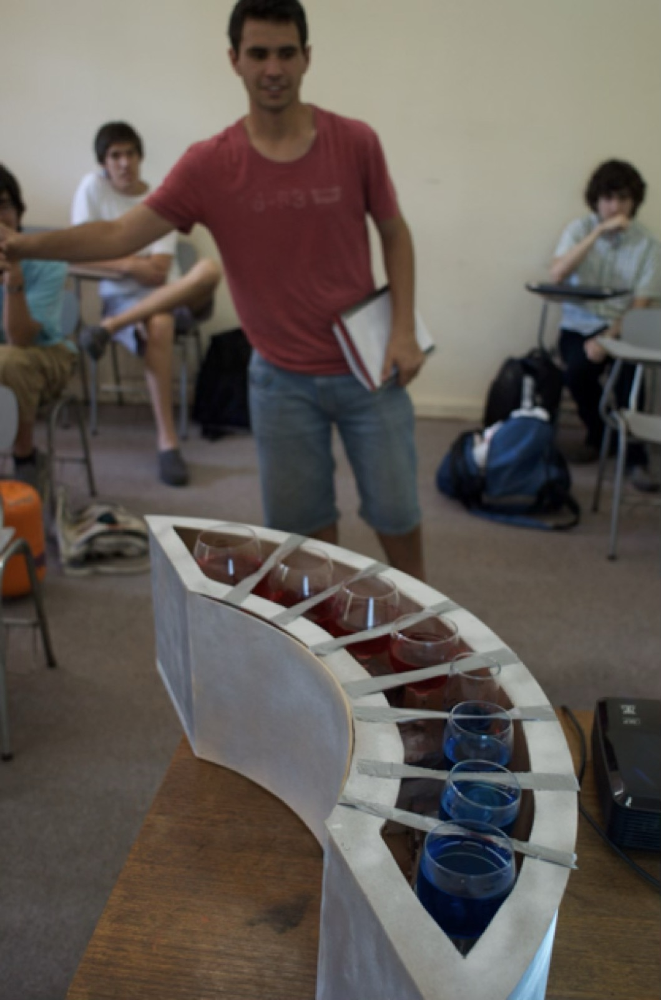
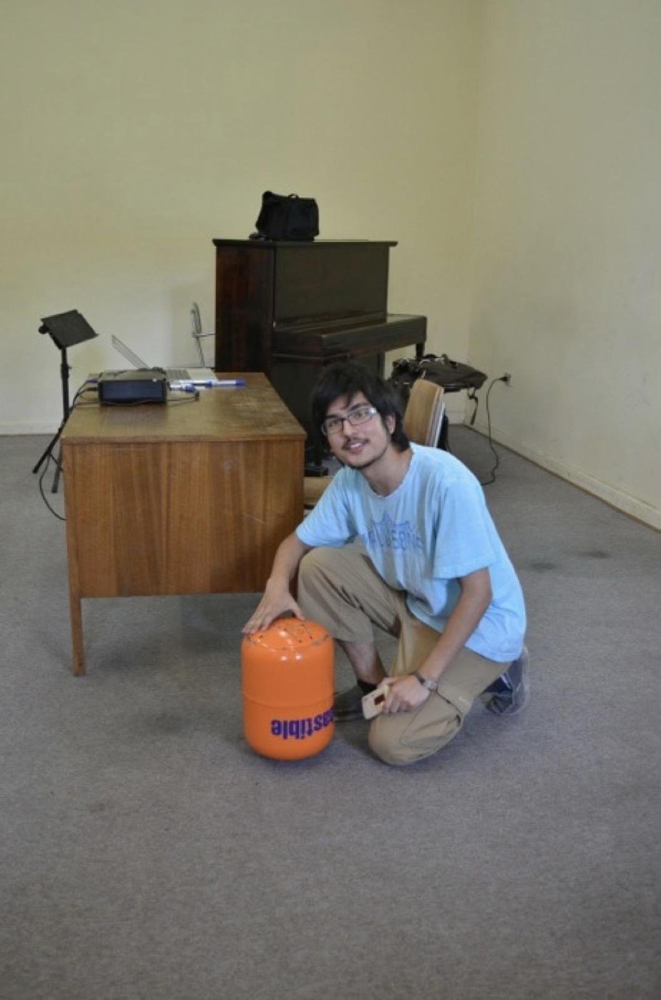
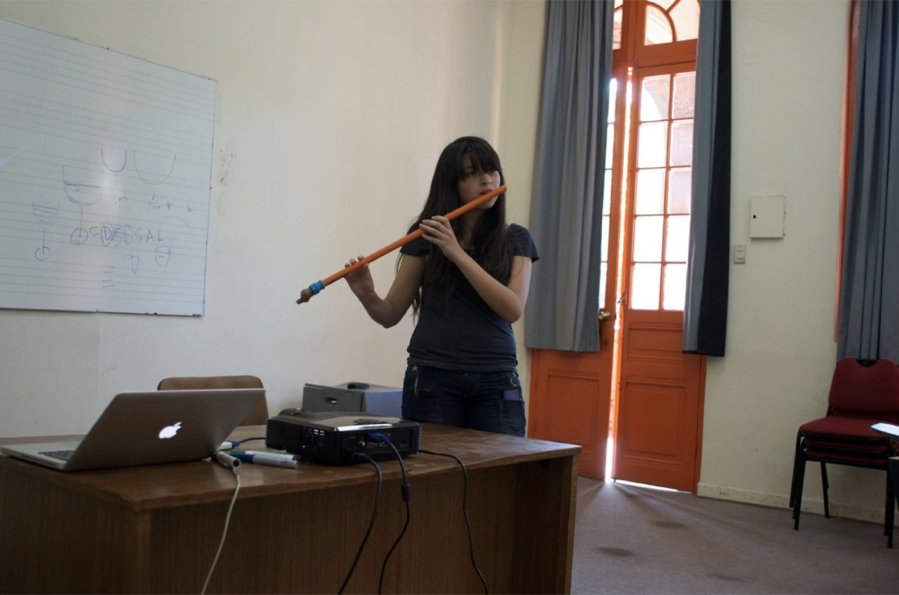
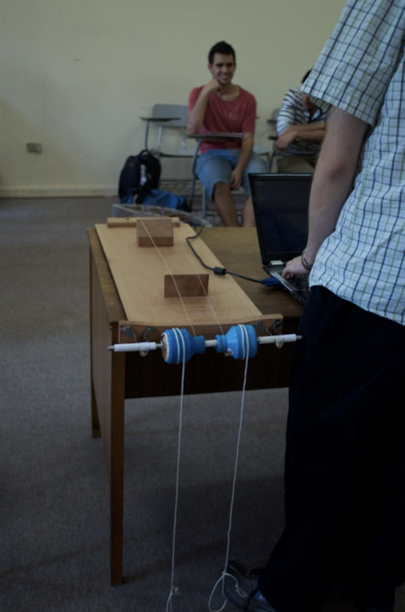
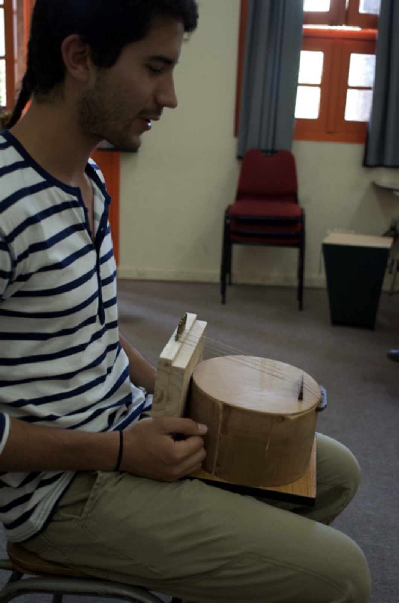
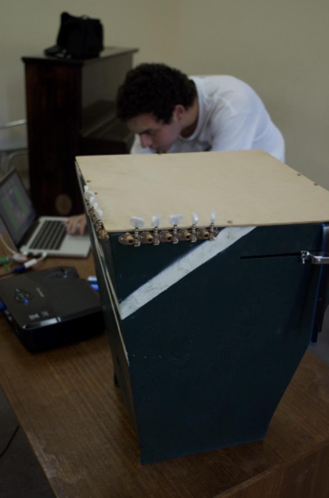
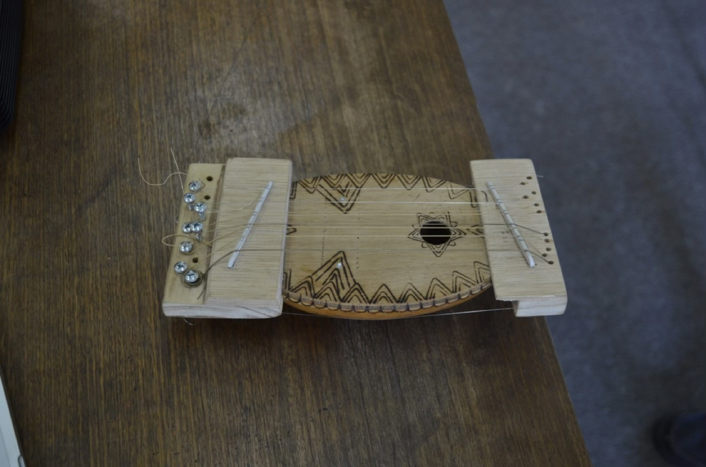

## Hoy: del golpe al lanzamiento del proyecto {.center}

> Semana universitaria: las actividades de hoy van **sin nota** (se
> hacen y se registran igual, no se califican).

| Módulo 1 — objetos golpeados | Módulo 2 — la cuerda y el proyecto |
|---|---|
| Escucha del día: en vivo | Gancho: la cuerda que sí afina |
| Veredicto + ¿qué es un modo? | Demo predictiva: modos de una cuerda |
| Taller PEE: la sartén y sus parientes | Percusión en 2D: membranas y placas |
| | **Lanzamiento del proyecto del curso** |

## Escucha del día: el protocolo {.center}

> Describir → hipotetizar → verificar

::: {.incremental}
- Escuchan el vaso golpeado, **dos pasadas** (borde y palma)
- Escritura: **2′**, su diagnóstico en 3 líneas
- Discuten en la mesa (**3′**): el vocero anota el diagnóstico del grupo
- Plenario (**3′**): el profesor pregunta a una o dos mesas — responde el vocero por el grupo — y cierra con su propia versión
:::

::: {.notes}
**Apoyo:**
- Antes de esta slide, golpee el vaso en vivo, dos pasadas (en el borde y con el vaso apoyado en la palma) — todavía SIN mostrar el espectrograma: primero el oído (plan, módulo 1, 0–10′).
- Pruebe el vaso ANTES de clase; si no da líneas claras (vaso grueso, ruido de sala), tenga un segundo vaso más resonante (copa) de respaldo (plan, "Riesgos y plan B").
- En el plenario, pregunte selectivamente a una o dos mesas — no a todas — y cierre con su propia versión experta (plan, columna "Rol del profesor").
:::

## ¿Cuántas líneas anotó en su ticket de la semana pasada? {.center}

Ese ticket de s02 ya tiene su apuesta por escrito.

. . .

Veámoslo — proyectado, en vivo.

::: {.notes}
**Apoyo:**
- Cierre la pregunta en suspenso antes de proyectar: "¿una línea o varias? ya lo escribieron la semana pasada — veamos" (plan, módulo 1, 0–10′).
- Al proyectar el espectrograma, contraste con lo que cada mesa predijo en su ticket de s02: son varias líneas, un puñado de líneas horizontales nítidas, cada una apagándose a su propio ritmo (apunte, "¿Por qué el vaso dio varias líneas y no una?").
- Si el vaso no dio líneas claras en vivo: la escucha del día se hace igual (es de oído) y el veredicto se toma con la grabación de respaldo hecha en casa (plan, "Riesgos y plan B").
:::

## ¿Qué significa que un objeto "vibre a varias frecuencias"?

> Cada objeto tiene un repertorio fijo de **frecuencias
> características**; cada una es un **modo**: una forma de vibrar de
> todo el objeto a la vez.

. . .

Una masa con un resorte: **una** manera de oscilar.

. . .

Dos masas encadenadas: **dos** coreografías posibles (juntas / en
oposición).

. . .

Muchas masas — como una cuerda, una membrana o una sartén — → **muchas**
frecuencias características.

::: {.notes}
**Apoyo:**
- Antes de la explicación, vote a mano alzada las preguntas de la mini-lección: ¿las líneas del vaso están igualmente espaciadas? ¿cuál dura más? (plan, módulo 1, 10–25′).
- Respuesta de fondo: el golpe no elige las frecuencias, solo decide con cuánta fuerza enciende cada modo del repertorio fijo del objeto (apunte, "¿Por qué el vaso dio varias líneas y no una?").
- La construcción de masas y resortes es la del capítulo 6 de Benade, "la mejor exposición cualitativa del tema que va a encontrar" (apunte, "¿Qué es exactamente 'una manera de vibrar'?"; cap. 6, secs. 6.1–6.5).
- Deje instalada la palabra **parcial** para "línea del espectro"; anuncie que **armónico** se gana en el módulo 2 (plan, columna "Rol del profesor").
:::

## Cada modo tiene lugares que no se mueven

> **Nodo**: no se mueve. **Antinodo**: máximo movimiento.

::: {.incremental}
- Un dedo en un **antinodo** apaga ese modo
- Un dedo en un **nodo** deja sobrevivir ese modo
:::

. . .

[Tocar un objeto en distintos puntos es editar su espectro, modo por
modo.]{style="color:#0f766e"}

::: {.notes}
**Apoyo:**
- Antes de responder, lance la pregunta del capítulo: si un modo tiene un lugar quieto y usted apoya ahí un dedo, ¿ese modo se apaga o sobrevive? ¿y si lo apoya donde el modo se mueve al máximo? (capítulo 3, "Dos detalles de la coreografía: nodos y decaimiento").
- Respuesta esperada: un dedo en un antinodo apaga ese modo; un dedo en un nodo lo deja sobrevivir — pídala primero a la sala antes de revelarla en la slide.
- Conecte con el taller que viene: en la fase 2, el dedo en el centro de la tapa mata unos parciales y perdona otros (apunte, "¿Qué es exactamente 'una manera de vibrar'?").
:::

## Taller: la sartén y sus parientes (30′)

**Antes de golpear** (5′): prediga cuántas líneas, si están igualmente
espaciadas, cuál dura más.

. . .

**Golpeen y midan** (15′): los 3 parciales más fuertes de 2 objetos;
calculen $f_2/f_1$ y $f_3/f_1$.

. . .

**Editen** (fase 2): golpe en el centro vs. cerca del borde; un dedo en
el centro mientras suena. Prediga primero, verifique después.

> Roles: **ejecuta** · **mide y registra** · **vocero** — roten
> entre los dos objetos.

::: {.notes}
**Apoyo:**
- Rote por los grupos (~6′ cada uno); provoque con: "¿las razones dan números enteros?", "¿el dedo apaga TODO el sonido o solo parte?" (plan, módulo 1, 25–60′).
- Recuerde a los grupos que el contraste predicción–resultado vale tanto como el acierto (plan, columna "Rol del profesor").
- Si las apps no resuelven los parciales (muy juntos o decaimiento rápido): la guía pide congelar/capturar la pantalla justo tras el golpe; plan B por kit: la tapa colgada de un cordel suena más largo; mínimo operativo: 3 parciales legibles por objeto (plan, "Riesgos y plan B").
:::

## ¿Algún objeto de la sala resultó armónico? {.center}

Ninguna sartén, tapa o taza dio razones $1:2:3$.

. . .

**¿Qué objeto sí las daría?**

::: {.notes}
**Apoyo:**
- Sintetice en el pizarrón las razones $f_2/f_1$ y $f_3/f_1$ de los 3 grupos: ninguna da 1 : 2 : 3 — son objetos inarmónicos (plan, módulo 1, 60–70′).
- Plante la pregunta puente antes de que la sala responda: "¿qué objeto tendría parciales en razones enteras?" (plan, columna "Rol del profesor").
:::

## La cuerda que sí afina {.center}

Escuchen: la cuerda al aire, y luego sus armónicos naturales (dedo
apoyado suavemente en la mitad, y en el tercio).

. . .

**¿Por qué la cuerda tiene una nota clara y la sartén no?**

::: {.notes}
**Apoyo:**
- Ejecute en guitarra (o monocordio/elástico grueso tensado sobre caja); no explique todavía — deje la pregunta abierta (plan, módulo 2, 0–10′).
- Si no hay guitarra a mano: el monocordio casero (elástico grueso tensado sobre una caja) muestra los armónicos en la mitad y el tercio igual; o la propia demo de cuerda como gancho, aunque se pierde el objeto real (plan, "Riesgos y plan B").
:::

## Antes de ver la demo: aposte {.center}

¿A qué intervalo suena el modo 2 respecto del modo 1? ¿Y el modo 3
respecto del modo 2? ¿Qué forma tiene el modo 3?

Activen "modo predicción" y verifiquen escuchando cada modo, uno por
uno.

::: {.notes}
**Apoyo:**
- Pida la apuesta a mano alzada ANTES de activar cada paso de la demo (plan, módulo 2, 10–25′).
- Respuesta de fondo (apunte, "La cuerda: el objeto que gana la lotería"): al tocar suavemente la cuerda en la mitad sobreviven los modos con nodo ahí y aparece la octava — el modo 2 suena una octava sobre el modo 1 (frecuencia doble); tocando en el tercio aparece la docena, la nota que los guitarristas llaman "armónico natural".
- El modo 3 tiene tres barrigas y dos nodos que dividen la cuerda en tercios (apunte, figura 1).
:::

## Demo: modos de una cuerda {background-iframe="../../demos/demo_modos_cuerda.html" background-interactive=true}

::: {.notes}
**Apoyo:**
- Opere la demo mostrando la forma espacial de los primeros modos, la frecuencia de cada uno ($f_n = n f_1$) y el sonido de cada modo solo y de la suma (plan, módulo 2, 10–25′).
- Con esta demo instale la distinción obligatoria: **parcial** es cualquier línea del espectro; **armónico** es un parcial en razón entera con la fundamental — la cuerda es el objeto armónico por excelencia, la sartén no (plan, columna "Rol del profesor").
:::

## Parcial ≠ armónico

> **Parcial**: cualquier línea del espectro, venga del objeto que
> venga.
> **Armónico**: parcial cuya frecuencia está en razón *entera* con la
> fundamental.

$$f_n = n\,f_1 \qquad n = 1, 2, 3, \dots$$

. . .

Todos los armónicos son parciales; casi ningún parcial de la sartén lo
es.

## ¿Por qué la percusión "no afina"? {.center}

Escuchen: timbal vs. tom.

. . .

En 2D los nodos se vuelven **líneas nodales** (figuras de Chladni).

. . .

Membranas y placas: parciales en razones **no enteras** →
inarmónicos.

. . .

El **timbal** es la excepción: caldero de aire + tensión afinable +
golpe cerca del borde acomodan los parciales en razones casi enteras →
aparece altura.

::: {.notes}
**Apoyo:**
- Antes de las figuras de Chladni, vote a mano alzada: ¿cuál tiene altura definida, el timbal o el tom? Respuesta: el timbal sí tiene altura clara; el tom, difusa (plan, módulo 2, 25–40′).
- El timbal es la excepción lograda: parche + caldero + punto de golpe corren algunos parciales hacia razones casi enteras y aparece altura (apunte, "¿Y cuándo el objeto es una superficie?"; BEN cap. 9, secs. 9.1–9.5; C&G cap. 10; ROS cap. 13).
- Al cerrar este bloque, chequeo relámpago a mano alzada: "el tercer parcial de la sartén ¿es un armónico?" — debe responderla la sala completa sin dudar; la respuesta es no, porque las razones de la sartén no caen en números enteros (plan, "Verificación de aprendizaje").
:::

## El proyecto del curso queda lanzado {.center}

**Individual**: construir o modificar un objeto que suene — o estudiar
a fondo un instrumento — y **explicar acústicamente** su
comportamiento.

> [La calidad de la explicación vale más que el éxito
> sonoro.]{style="color:#0f766e"}

Vale **35 %** de la nota final.

::: {.notes}
**Apoyo:**
- Presente el enunciado completo: qué es (proyecto individual — cada estudiante persigue su propio objeto; la mesa es equipo de apoyo, no dueña del proyecto), los 3 hitos con fechas y porcentajes, la regla de oro, la bitácora individual desde hoy y que los talleres de medición s08–s12 se hacen sobre el objeto propio con la mesa como apoyo (plan, módulo 2, 40–65′).
- Si el lanzamiento se come la discusión: el trabajo de ideas sigue por bitácora durante la semana y la media hoja puede entregarse hasta el inicio de s04 sin penalización; lo innegociable hoy es que el enunciado quede entendido (plan, "Riesgos y plan B").
:::

## Así se ve: proyectos de otras generaciones {.center}

{height=340} {height=340} {height=340}

Copófono en arco · tambor de balón de gas · flauta de PVC

::: {.notes}
Fotos del archivo del curso con personas identificables: solo para
proyectar en clase; excluidas del sitio público por el CI.
:::

## Y más {.center}

{height=300} {height=300} {height=300} {height=300}

Monocordio con contrapesos · cordófonos artesanales · salterio

. . .

**Todos empezaron igual: un objeto, una pregunta, un celular.**

## Tres hitos, todo el semestre

| Hito | Sesión | Entrega | % |
|---|---|---|---|
| 1 — Diseño con predicción | s05 | predicción escrita + modelo del curso | 10 % |
| 2 — Avance | s10 | mediciones + evidencia sonora | 10 % |
| Final | s15 | defensa (~11′) + informe ≤ 6 págs | 15 % |

## Cómo se juega

::: {.incremental}
- **Proyecto individual**: cada uno construye SU objeto; la mesa es
  equipo de apoyo, no dueña del proyecto
- **Bitácora**: individual — fecha, qué hizo, qué midió
- **Defensa individual**: en s15 responde usted solo, su propio objeto
:::

## Para hoy: 15 minutos de ideas {.center}

Cada uno, 2 ideas candidatas propias — media hoja con, para cada una
(la mesa opina, no decide):

::: {.incremental}
1. ¿Qué es y qué suena?
2. ¿Qué modelo del curso permitiría **predecir** su sonido?
3. ¿Qué medirían con el celular para comprobarlo?
:::

> Sin nota — el profesor la devuelve comentada en s04.

::: {.notes}
**Apoyo:**
- Mientras cada uno escribe su media hoja, rote por las mesas empujando a cada estudiante hacia ideas medibles y realistas (plan, columna "Rol del profesor").
- Criterios para elegir el objeto: que suene, que tenga al menos un parámetro modificable (longitud, tensión, masa, agujeros, material…) y que sea medible con los medios del curso (enunciado del proyecto, "Qué es").
:::

## Ticket de salida {.center}

Si pulsa la MISMA cuerda en el medio, o muy cerca del puente...

. . .

**¿cambia la nota, o cambia el timbre? ¿por qué?**

::: {.notes}
**Apoyo:**
- No responda la pregunta ahora: queda deliberadamente abierta y se retoma al abrir s04 con la "receta del timbre" (plan, módulo 2, 65–70′; apunte, "Hacia la sesión 04").
:::

## Síntesis del día

::: {.incremental}
- Todo objeto tiene un repertorio fijo de **modos**; el golpe no crea
  frecuencias, las **enciende**
- Dónde se golpea o se toca decide qué modos suenan
- Cuerda: $f_n = n f_1$ → armónicos. Membranas y placas: inarmónicos
- **El proyecto del curso queda lanzado**
:::

## Para la próxima sesión

::: {.incremental}
- **Traer instrumentos de cuerda pulsada** (guitarra, charango,
  ukelele — 1 o 2 por grupo)
- Bitácora del proyecto al día
- Hito 1 en s05
:::
