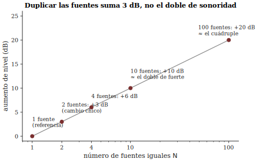

# Sonoridad y decibel: medir lo fuerte

**Sesión 06** · Curso Acústica Musical UC
**Objetivos que cubre**: OA4.2 (medir niveles e interpretar el decibel y
las curvas de sonoridad en contextos musicales; salud auditiva), OA2.1
(el par intensidad↔sonoridad no es lineal ni unívoco).

## ¿Cuánto es "el doble de fuerte"?

En la sesión 5 quedó establecido que la altura no copia la frecuencia:
el oído reconstruye un patrón y hasta oye un bajo que el parlante no
radia. Esta sesión repitió la jugada con el otro par del ticket de
salida: **la intensidad es del sonido; la sonoridad es suya**. Dos
sonidos con la misma frecuencia pueden oírse a volúmenes completamente
distintos — eso era lo fácil. Lo incómodo era la segunda pregunta: un
grave y un agudo con exactamente la misma energía física *no* suenan
igual de fuertes. Usted lo comprobó dibujando su propia curva isofónica,
y lo había oído al comienzo: la misma mezcla musical, reproducida muy
suave, pierde el bajo y el brillo, aunque en la señal siguen estando.

Para hablar de esto con números primero hay que medir el lado físico.
La **intensidad** de un sonido es la energía que atraviesa cada segundo
una superficie dada; en la práctica de esta sesión trabajamos con su
prima medible, la **presión sonora** $p$ (en pascales), que es lo que
detectan el tímpano, el micrófono y la app del celular. Y aquí aparece
el primer dato asombroso del día: entre el sonido más débil que un oído
sano alcanza a detectar y el nivel que ya duele hay un factor de
alrededor de **un millón de millones (10¹²) en intensidad** (Benade
1990, sec. 13.1; ROS cap. 6). Ningún instrumento de medición cómodo, y
ningún sistema perceptual razonable, trabaja con un rango así en escala
lineal.

## El decibel: una escala para un oído que compara multiplicando

La solución de la acústica es la misma que adoptó el oído: en vez de
*sumar* energía, **comparar por factores**. El **decibel** no es una
cantidad de sonido sino una forma de expresar la razón entre dos
sonidos (Benade 1990, sec. 13.2). Su gramática completa, con la
aritmética mínima del curso:

- **+10 dB significa ×10 en intensidad.** +20 dB, ×100. +30 dB, ×1000:
  cada 10 dB se agrega un cero al factor.
- **+3 dB significa ×2 en intensidad** — y perceptualmente es un cambio
  chico, un pasito de volumen.
- Para que algo suene aproximadamente **el doble de fuerte** se
  necesita alrededor de **+10 dB**, es decir, diez veces más energía
  (Benade 1990, sec. 13.4).

Para convertir el dB en un nivel absoluto solo falta acordar con qué se
compara. La referencia universal es una presión de **20 µPa**
(veinte millonésimas de pascal), elegida porque coincide más o menos
con el umbral de audición a 1000 Hz — Benade la recuerda como
"1/3.530.000.000 de la presión atmosférica" (sec. 13.1). El **nivel de
presión sonora** se anota entonces $L_p$ en **dB SPL re 20 µPa**
(notación de diseno/03), y con la referencia puesta en el umbral, la
escala queda humana: 0 dB SPL es apenas audible y unos 120 dB SPL
rozan el dolor (Benade 1990, sec. 13.8). Entre medio caben, en rangos
aproximados, un susurro (~30 dB), una conversación (~60 dB), y una
orquesta o una banda en fortissimo (~95–110 dB) (ROS cap. 6; valores
típicos, no medidos en nuestras salas — los de nuestras salas los está
midiendo usted).

> **Recuadro opcional (para quienes quieren la fórmula).** El nivel se
> define como $L_p = 20\log_{10}(p/p_0)$ con $p_0 = 20\ \mu$Pa, o
> equivalentemente $10\log_{10}(I/I_0)$ sobre intensidades. De ahí que
> ×10 en presión sean +20 dB pero ×10 en intensidad sean +10 dB: la
> intensidad va como el cuadrado de la presión, y duplicar la amplitud
> de presión da +6 dB (Benade 1990, sec. 13.2, fig. 13.2). En el curso
> basta la tabla de reglas; la fórmula es para el que la disfrute.

## Dos guitarras no suenan el doble de fuerte

Las estaciones dejaron un resultado que contradice la intuición
aritmética: al hacer sonar **dos fuentes iguales**, el medidor no
duplicó nada visible — subió unos **+3 dB**. Las presiones de fuentes
independientes no se suman de frente: se combinan estadísticamente
(como la raíz de la suma de los cuadrados, Benade 1990, sec. 13.2), de
modo que duplicar las fuentes duplica la *energía*, no la amplitud. Y
como +3 dB está lejos del +10 dB del "doble de fuerte", la consecuencia
musical es fuerte: **se necesitan unas diez fuentes iguales para que
algo suene el doble de fuerte, y unas cien para el cuádruple** (Benade
1990, sec. 13.5) (figura 2).

 Por eso duplicar los violines de una orquesta engorda
el sonido mucho más de lo que lo agranda, y por eso el crescendo de
verdad se hace tocando más fuerte, no sumando atriles.

## ¿Por qué la mezcla suave pierde el bajo?

La segunda mitad del cuento es que el oído no es un medidor plano: su
sensibilidad **depende de la frecuencia, y de manera distinta según el
nivel**. Las **curvas isofónicas** (curvas de igual sonoridad,
graduadas en **fones**) mapean cuántos dB SPL hacen falta, en cada
frecuencia, para igualar la sonoridad de un tono de 1000 Hz. Su forma
general — que usted reprodujo a su manera en la demo — dice que somos
relativamente sordos a los graves (y a los muy agudos), y que esa
sordera **se agrava a niveles bajos** (Benade 1990, secs. 13.3–13.4;
C&G cap. 3, sección *Loudness*; ROE sec. 3.4) (figura 3).

Eso resuelve la escucha del día: al bajar el volumen, todos los
componentes bajan los mismos dB, pero los graves caen más rápido hacia
el umbral que el registro medio. La mezcla no perdió el bajo: **su oído
lo soltó primero**. El mismo mecanismo explica el botón "loudness" de
los equipos antiguos, y la advertencia de Benade (sec. 13.4) de que
ecualizar todo a igual sonoridad produce música de bajos y agudos
artificiales: los arreglos y las mezclas ya cuentan con las isofónicas
puestas.

De aquí salen dos unidades perceptuales que en el curso se usan solo
cualitativamente. El **fon** etiqueta cada isofónica con el nivel que
tiene a 1000 Hz. El **son** mide la sonoridad misma: 1 son es la
sonoridad de un tono de 1000 Hz a 40 dB SPL, y — a diferencia de los
decibeles — **los sones se suman como cantidades ordinarias**: 2 sones
más 3 sones se oyen como 5 sones (Benade 1990, sec. 13.4). La regla
"+10 dB ≈ doble sonoridad" es exactamente "×2 en sones".

## Medir con juicio: la app, el sonómetro y la ponderación A

Lo que usted usó en el celular imita al **sonómetro** clásico (Benade
1990, sec. 13.8): un micrófono, un filtro y un indicador en dB. El
filtro es la **ponderación A** — una curva que atenúa los graves
imitando a grandes rasgos la isofónica de nivel bajo — y por eso las
apps reportan **dB(A)**. Basta saber leerla: dB(A) descuenta lo que el
oído descuenta; la teoría del filtro no es materia del curso. Las
reglas de higiene de la medición salieron solas en las estaciones:

- El micrófono del celular **no está calibrado**: los valores absolutos
  pueden errar en varios dB ([`materiales/apps_recomendadas.md`](../../../materiales/apps_recomendadas.md)), y dos
  celulares lado a lado pueden discrepar. Las **comparaciones relativas
  con el mismo aparato** — ¿cuánto subió?, ¿cuál punto de la sala es
  más ruidoso? — sí son confiables.
- Anotar siempre **las condiciones**: qué app, qué celular, a qué
  distancia, ponderación usada. Un número sin condiciones no es un dato.
- El sonómetro **no mide sonoridad** (no sabe de enmascaramiento ni de
  sones, Benade 1990, sec. 13.8): mide un nivel ponderado. Es una
  herramienta honesta si uno no le pide lo que no da.

## El oído no tiene párpados

La misma aritmética del dB gobierna la **salud auditiva del músico**, y
aquí deja de ser un juego de proporciones. El criterio de referencia
ocupacional más citado admite del orden de **8 horas diarias a 85
dB(A)**, y cada **+3 dB** (el doble de energía) **corta el tiempo
admisible a la mitad**: 88 dB(A) → 4 h, 91 → 2 h, 94 → 1 h (criterio
NIOSH; ROS caps. 30–31). Un ensayo intenso puede vivir en los 90 y
tantos dB(A) y una banda amplificada bastante más arriba: la dosis se
gasta rápido, y el daño por exposición acumulada es indoloro y no se
recupera. Los valores límite de la norma chilena aplicable van en la misma
línea: el **DS 594** (Ministerio de Salud, 1999, arts. 74–75, vigente
en 2026) fija idéntico tope — 85 dB(A) lento por 8 horas — y construye
su tabla de tiempos admisibles con la **misma regla de intercambio de
3 dB** (no de 5 dB). Las decisiones prácticas que sí están al alcance
salieron en la estación E5: medir el propio ensayo, alejarse de la
fuente cuando se pueda, y usar protectores (los de músico atenúan de
forma más pareja que la espuma) — unos 15–25 dB de atenuación típica
(rango de referencia de los protectores de músico de atenuación plana,
tipo ER-15/ER-20, y de tapones y orejeras de uso comercial en su
atenuación efectiva de terreno) compran, por la regla de los 3 dB,
muchas veces más tiempo.

## Síntesis

- Intensidad/presión son del sonido; la **sonoridad** es del oyente. El
  par, como el de s05, no es lineal ni unívoco.
- El dB compara por factores: **+10 dB = ×10 intensidad ≈ doble
  sonoridad; +3 dB = ×2 intensidad, cambio chico**. $L_p$ en dB SPL re
  20 µPa; 0 dB ≈ umbral, ~120 dB ≈ dolor.
- Dos fuentes iguales → +3 dB; **diez** fuentes para el doble de
  sonoridad.
- Las **isofónicas** muestran un oído sordo a los graves, peor a bajo
  nivel: por eso la mezcla suave pierde el bajo, y por eso las apps
  ponderan en dB(A).
- Medir con juicio: condiciones anotadas, comparaciones relativas con
  el mismo aparato, y la dosis auditiva vigilada (85 dB(A)/8 h; −mitad
  cada +3 dB).

## Hacia la sesión 07

La sesión 7 abre con la **prueba 1** (módulo 1): entra todo s01–s06,
lo de hoy en su versión básica — leer un nivel, aplicar +10/+3,
interpretar una isofónica. Y su ticket de salida dejó sembrado el
módulo 2: dos flautas en la misma nota, una apenas desafinada.
¿Qué se oye? Algo que no es ni una nota ni dos, y que late. Traiga los
oídos descansados.

## Referencias y lectura complementaria

- Benade, A. H. (1990). *Fundamentals of Musical Acoustics*, 2.ª ed.
  Dover — cap. 13, secs. 13.1–13.5 (umbrales, decibel, sones, suma de
  fuentes) y 13.8 (sonómetro y ponderaciones); experimentos en 13.9
  (EEQ).
- Campbell, M. & Greated, C. (1987). *The Musician's Guide to
  Acoustics*. Oxford UP — cap. 3, sección *Loudness* (pp. 69–164 del
  capítulo completo).
- Roederer, J. G. (1997). *Acústica y Psicoacústica de la Música*.
  Ricordi — cap. 3, secs. 3.4–3.5 (pp. 79–119): intensidad, nivel y
  mecanismo de percepción de sonoridad; en español.
- Rossing, T. D., Moore, F. R. & Wheeler, P. A. (2002). *The Science of
  Sound*, 3.ª ed. — cap. 6 (dB, fones, sones: el banco de ejercicios de
  la prueba) y caps. 30–31 (niveles ambientales y efectos del ruido).
- Chile, Ministerio de Salud. Decreto Supremo N.º 594 (1999), *Reglamento
  sobre condiciones sanitarias y ambientales básicas en los lugares de
  trabajo*, arts. 74–75 (texto vigente, leychile.cl/BCN).
