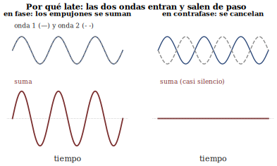

## Hoy {.center}

**Módulo 1** — Prueba 1 (ocupa todo el módulo)

**Módulo 2** — audición liviana: batidos (sin nota)

. . .

Vuelvan del módulo 1 descansados: el 2 se escucha con los oídos.

## Antes de empezar la prueba

- Puesto individual, en columnas separadas
- Celular, apuntes y audífonos → a la mochila
- Cuadernillo (boca abajo) + hoja de figuras aparte
- No se necesita calculadora
- Preguntas solo de **forma**, a mano alzada

## Calendario de audio {.center}

| Minuto | Qué suena |
|---|---|
| **10** | Estímulo 1 (2 veces) |
| **25** | Estímulos 2 y 3 (2 veces cada uno) |
| **40** | Pasada de repaso (1 vez cada uno) |

Cada estímulo suena por el equipo de sala, igual para todos.

## Se cobra el ticket de s06 {.center}

> Dos flautas tocan la **misma nota**. Una queda apenas desafinada.

**¿Qué es esa ondulación?**

## Contemos juntos

Antes de mirar cualquier número: **cuenten en voz alta** las
ondulaciones por segundo.

## Demo: contar el batido {background-iframe="../demos/demo_batidos.html" background-interactive=true}

## ¿Cuántas contaron?

$f_1 = 440$ Hz fijo. $f_2 = 443$ Hz.

. . .

**Tres** por segundo. Con 442 Hz, dos. Con 437 Hz, tres otra vez —
da lo mismo hacia qué lado está la desafinación.

## La regla {.center}

> $$f_b = |f_2 - f_1|$$
>
> [Un batido por segundo por cada hertz de diferencia.]{style="color:#0f766e"}

## ¿Por qué late?

Dos trenes de empujones al aire, casi al mismo ritmo:

::: {.incremental}
- **En fase**: los empujones se suman → refuerzo
- **En contrafase**: uno empuja, el otro succiona → silencio
- Ese ciclo refuerzo–silencio se repite $|f_2-f_1|$ veces por segundo
:::

## Votación

$f_1=440$, $f_2=443$. ¿Cuántos batidos por segundo predice la regla?

. . .

**3** — coincide con lo que ya contaron.

## Ahora ustedes: afinar solo de oído

Un voluntario lleva $f_2$ al unísono **sin mirar los números**.

## Demo: modo afinación {background-iframe="../demos/demo_batidos.html" background-interactive=true}

## La receta del afinador

::: {.incremental}
- Toque las dos fuentes juntas
- El batido, cada vez **más lento**…
- … hasta que **se detenga**
:::

> [Batido detenido = unísono.]{style="color:#0f766e"}

Así afinan los pianos desde hace dos siglos — en s09 lo hacemos en serio.

## El borde del fenómeno {.center}

¿Qué pasa si alejamos $f_2$ cada vez más?

Anoten: ¿dónde dejan de poder contar? ¿qué oyen ahí?

## Demo: barriendo Δf hacia arriba {background-iframe="../demos/demo_batidos.html" background-interactive=true}

## Síntesis del día

::: {.incremental}
- Un batido por segundo por cada Hz de diferencia
- El batido delata desafinaciones que el oído no distingue como dos alturas
- Batido detenido = unísono
:::

## Ticket de salida hacia s08 {.center}

Cuando la diferencia crece más allá de lo que "batea"…

**¿qué se oye, y dónde termina eso?**

## Para la próxima

- s08: taller psicoacústico — **traigan audífonos**
- Comienzan los talleres de medición sobre el objeto del proyecto
  (s08–s12): traigan su objeto o un avance medible
- Vuelve la ronda oral OA3 (pasada 2)
