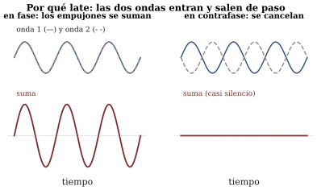

## Hoy {.center}

**Módulo 1** — Prueba 1 (ocupa todo el módulo)

**Módulo 2** — audición liviana: batidos (sin nota)

. . .

Vuelvan del módulo 1 descansados: el 2 se escucha con los oídos.

::: {.notes}
**Apoyo:** Esta semana se aplican dos reglas del diseño: en una
sesión con prueba, la prueba ocupa todo el módulo 1 y el módulo 2 es
de audición liviana; por eso esta semana no hay escucha del día (va
dentro de la prueba, como escucha escrita) ni taller evaluado — la
prueba es la evaluación de la semana. La escucha del día, práctica y
sin nota, vuelve en s08 (plan, "Reglas aplicadas").
:::

## Antes de empezar la prueba

- Puesto individual, en columnas separadas
- Celular, apuntes y audífonos → a la mochila
- Cuadernillo (boca abajo) + hoja de figuras aparte
- No se necesita calculadora
- Preguntas solo de **forma**, a mano alzada

::: {.notes}
**Apoyo:** Puestos en columnas separadas, preparados antes si la
sala lo permite; cuadernillo boca abajo y hoja de figuras aparte.
Antes de la clase, pruebe los 3 archivos de audio en el equipo de la
sala (regla del banco de estímulos). Recuerde el calendario de audio
(próxima slide): cada estímulo suena 2 veces con ~45 s de pausa entre
repeticiones, y en el minuto 40 hay una pasada de repaso de una vez
cada estímulo. Preguntas solo de forma, a mano alzada (plan, módulo
1, fila 0–7′). Si falla el audio de la sala durante la prueba, los 3
estímulos están también en el celular del profesor y se reproducen
por su parlante caminando por la sala — validado en s05 (plan,
"Riesgos y plan B").
:::

## Calendario de audio {.center}

| Minuto | Qué suena |
|---|---|
| **10** | Estímulo 1 (2 veces) |
| **25** | Estímulos 2 y 3 (2 veces cada uno) |
| **40** | Pasada de repaso (1 vez cada uno) |

Cada estímulo suena por el equipo de sala, igual para todos.

::: {.notes}
**Apoyo:** Cada estímulo suena 2 veces con ~45 s de pausa entre
repeticiones; la pasada del minuto 40 es de repaso, 1 vez cada
estímulo. Quien llega antes del minuto 25 alcanza todo — el repaso
del minuto 40 le repone el estímulo 1; quien llega después del
minuto 25 rinde igual y el caso se resuelve según el reglamento de
la unidad académica: no se detiene la prueba ni se repite audio
fuera de calendario (plan, módulo 1, fila 7–67′).
:::

## Se cobra el ticket de s06 {.center}

> Dos flautas tocan la **misma nota**. Una queda apenas desafinada.

**¿Qué es esa ondulación?**

::: {.notes}
**Apoyo:** Toque (o haga sonar) las dos flautas al unísono
imperfecto, sostenido al menos 10 segundos, y lea 2–3 tickets de s06
recopilados antes de preguntar; no explique todavía — la idea es
dejar plantado que "eso que ondula tiene nombre y número, y hoy los
vamos a encontrar" (plan, módulo 2, fila 0–8′). Respuesta esperada:
no son dos notas ni una nota simplemente desafinada — es una sola
nota cuya sonoridad ondula, un guau–guau–guau regular, como si
alguien subiera y bajara el volumen varias veces por segundo
(apunte, "¿Qué es esa ondulación?"). Si no hay flautas disponibles:
demo en dos notebooks desincronizados (440 vs 442 Hz) o flauta real
contra tono de la demo a 440 Hz — el fenómeno es idéntico (plan,
"Riesgos y plan B").
:::

## Contemos juntos

Antes de mirar cualquier número: **cuenten en voz alta** las
ondulaciones por segundo.

::: {.notes}
**Apoyo:** Pida que cuenten en voz alta antes de revelar cualquier
número — es la predicción a mano alzada que pide el plan antes de
cada cambio de f₂ (plan, módulo 2, fila 8–22′).
:::

## Demo: contar el batido {background-iframe="../../demos/demo_batidos.html" background-interactive=true}

::: {.notes}
**Apoyo:** Opere la demo con el marcador de f_b oculto primero: el
curso cuenta y luego se revela f_b = |f₂−f₁| en pantalla. El plan
indica recorrer f₂ = 442, 444 y 437 Hz con f₁ = 440 Hz fija (plan,
módulo 2, fila 8–22′). Pregunte "¿alguien oye DOS notas?" —
respuesta esperada: no, una sola nota que ondula, no dos notas
(apunte, "¿Por qué oímos una sola nota y no dos?").
:::

## ¿Cuántas contaron?

$f_1 = 440$ Hz fijo. $f_2 = 443$ Hz.

. . .

**Tres** por segundo. Con 442 Hz, dos. Con 437 Hz, tres otra vez —
da lo mismo hacia qué lado está la desafinación.

::: {.notes}
**Apoyo:** Cifras del apunte: con f₁=440 Hz y f₂=443 Hz el curso
contó tres ondulaciones por segundo; con 442 Hz, dos; con 437 Hz,
tres de nuevo — da lo mismo hacia qué lado está la desafinación
(apunte, "¿Qué es esa ondulación?").
:::

## La regla {.center}

> $$f_b = |f_2 - f_1|$$
>
> [Un batido por segundo por cada hertz de diferencia.]{style="color:#0f766e"}

::: {.notes}
**Apoyo:** Complemento del apunte: la regla f_b=|f₂−f₁| es una de
las relaciones más limpias del curso — no es aproximada, no depende
del instrumento ni del oyente, y se verifica contando con los dedos
(apunte, "¿Qué es esa ondulación?").
:::

## ¿Por qué late?

Dos trenes de empujones al aire, casi al mismo ritmo:

::: {.incremental}
- **En fase**: los empujones se suman → refuerzo
- **En contrafase**: uno empuja, el otro succiona → silencio
- Ese ciclo refuerzo–silencio se repite $|f_2-f_1|$ veces por segundo
:::

::: {.notes}
**Apoyo:** El argumento sin trigonometría (apunte, "¿Por qué dos
tonos casi iguales laten?"): dos trenes de empujones casi
sincronizados se refuerzan cuando empujan a la vez (en fase) y se
cancelan cuando uno empuja y el otro succiona (en contrafase); con
1 Hz de diferencia ese ciclo de refuerzo–cancelación ocurre una vez
por segundo, con 3 Hz ocurre tres veces. El nombre técnico es
"batido de primer orden" (Roederer, 1997, cap. 2, sec. 2.4, citado
en el apunte). Recuadro opcional del apunte para quien pida el
detalle: la suma de dos sinusoides se puede escribir como una onda
rápida a la frecuencia promedio multiplicada por una envolvente
lenta, y como el oído no distingue el signo de la envolvente, se
oyen dos máximos por ciclo — los batidos ocurren a |f₂−f₁| por
segundo, no a la mitad (apunte, recuadro opcional).
:::

## Votación

$f_1=440$, $f_2=443$. ¿Cuántos batidos por segundo predice la regla?

. . .

**3** — coincide con lo que ya contaron.

::: {.notes}
**Apoyo:** Respuesta esperada: 3 batidos por segundo
(f_b=|443−440|=3), coincide con lo ya contado con la demo (plan,
módulo 2, fila 22–35′).
:::

## Ahora ustedes: afinar solo de oído

Un voluntario lleva $f_2$ al unísono **sin mirar los números**.

::: {.notes}
**Apoyo:** Pida 3–4 voluntarios; modere el juego con tono relajado
— es después de la prueba y sin nota (plan, módulo 2, fila 35–52′).
Si hay una segunda flauta o dos cuerdas reales disponibles, un
voluntario puede repetir el ejercicio afinando el instrumento real
contra el otro.
:::

## Demo: modo afinación {background-iframe="../../demos/demo_batidos.html" background-interactive=true}

::: {.notes}
**Apoyo:** El curso arbitra en voz alta mientras el voluntario
ajusta f₂ ("todavía bate… ahí quedó"). Al revelar los números,
muestre cuán cerca quedó cada voluntario — ¿1 Hz? ¿0,5 Hz? (plan,
módulo 2, fila 35–52′). El apunte señala que en este juego los
voluntarios llegan rutinariamente a menos de 1 Hz de error solo
escuchando; con paciencia, el método llega a fracciones de hertz
(apunte, "¿Cómo se convierte el batido en una herramienta de
afinación?").
:::

## La receta del afinador

::: {.incremental}
- Toque las dos fuentes juntas
- El batido, cada vez **más lento**…
- … hasta que **se detenga**
:::

> [Batido detenido = unísono.]{style="color:#0f766e"}

Así afinan los pianos desde hace dos siglos — en s09 lo hacemos en serio.

::: {.notes}
**Apoyo:** Complemento de cierre (apunte, "¿Cómo se convierte el
batido en una herramienta de afinación?"): el batido es un detector
de desafinación más fino que el oído melódico — si dos cuerdas
difieren en 1 Hz, ningún oído las distingue como dos alturas, pero
cualquier oído cuenta un batido por segundo sin esfuerzo. En s09 la
herramienta pasa de truco a oficio: no solo los unísonos, también
los intervalos (octavas, quintas, terceras) producen batidos
característicos cuando están desafinados, y contando batidos se
afina un temperamento completo — el procedimiento histórico de los
afinadores de piano (Benade, 1990, cap. 16, lo describe paso a
paso).
:::

## El borde del fenómeno {.center}

¿Qué pasa si alejamos $f_2$ cada vez más?

Anoten: ¿dónde dejan de poder contar? ¿qué oyen ahí?

::: {.notes}
**Apoyo:** No explique todavía lo que va a aparecer — la rugosidad
y la separación en dos notas son el corazón de s08 (plan, módulo 2,
fila 52–62′); limítese a recoger las palabras del curso. Para su
propia orientación (no lo diga en clase): el apunte adelanta que en
algún punto los batidos se vuelven demasiado rápidos para
contarlos, la ondulación se convierte en aspereza y, más allá,
aparecen dos notas distinguibles — el desarrollo completo es el
tema de s08 (apunte, "¿Por qué oímos una sola nota y no dos?").
:::

## Demo: barriendo Δf hacia arriba {background-iframe="../../demos/demo_batidos.html" background-interactive=true}

::: {.notes}
**Apoyo:** Recorra Δf lentamente hacia arriba — 5, 10, 15, 20, 30
Hz, f₂ hasta 470 Hz — y anote en el pizarrón las palabras que use el
curso ("áspero", "granulado", "se separó") sin explicarlas (plan,
módulo 2, fila 52–62′). Si la demo no corre en el equipo de
proyección: dos celulares con generador de tonos a 440/442 Hz sobre
el micrófono del equipo (se pierde la envolvente visual, no el
fenómeno) y dibuje la envolvente en el pizarrón (plan, "Riesgos y
plan B").
:::

## Síntesis del día

::: {.incremental}
- Un batido por segundo por cada Hz de diferencia
- El batido delata desafinaciones que el oído no distingue como dos alturas
- Batido detenido = unísono
:::

## Ticket de salida hacia s08 {.center}

Cuando la diferencia crece más allá de lo que "batea"…

**¿qué se oye, y dónde termina eso?**

::: {.notes}
**Apoyo:** Recoja los tickets al cierre; el plan los define como el
eslabón hacia la escucha del día de s08 (banda crítica) (plan,
"Cadena de tickets").
:::

## Para la próxima

- s08: taller psicoacústico — **traigan audífonos**
- Comienzan los talleres de medición sobre el objeto del proyecto
  (s08–s12): traigan su objeto o un avance medible
- Vuelve la escucha del día (práctica, sin nota)
