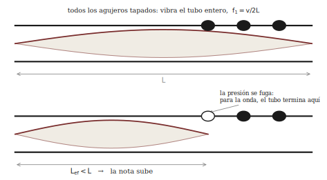

# Capítulo 12 — Vientos y lutería: la columna de aire a la medida

*Lectura previa a la sesión 12. Objetivos: OA1.2, OA1.3, OA5.2.*

## Un instrumento sin partes móviles

Mire una flauta de cerca — la que sea: traversa, dulce, quena, un tubo
de pan. Ahora hágale la pregunta de la semana pasada. En la cuerda
frotada encontramos una válvula (la fricción, que agarra y suelta) y un
metrónomo (la cuerda misma, que le impone su vaivén). ¿Dónde está la
válvula de la flauta? No hay crin, no hay resina, no hay caña que se
cierre, no hay labios zumbando como en la trompeta. No hay, en rigor,
ninguna pieza que se mueva. Solo un tubo con agujeros y una persona que
sopla. Y sin embargo la nota sale estable, afinada y sostenida — la
firma inconfundible de una oscilación auto-sostenida, que ya sabemos
leer: si hay nota estable, *algo* está entregando energía en ciclos, y
*algo* le está marcando el compás.

Su ticket de salida de la sesión pasada dejó la pregunta armada, y este
capítulo la responde. La sesión, además, le va a pedir algo más que
entenderlo: va a **construir** un instrumento de viento — modesto, de
PVC, pero suyo — prediciendo su nota antes de cortarlo. Es la única
sesión del curso dedicada por completo a la lutería, y el profesor pone
sobre la mesa su propio caso de estudio: las flautas que investiga y
construye desde hace décadas.

## La válvula invisible

Cuando usted sopla el borde de una botella, o la embocadura de una
flauta, sus labios lanzan una lámina delgada de aire — un **chorro** —
contra un filo: el **bisel**. Un chorro contra un filo es un sistema
maravillosamente indeciso. Puede pasar por dentro; puede pasar por
fuera; y basta una corriente lateral minúscula para convencerlo de
cambiar de bando.

Esa corriente lateral existe, y viene del propio tubo. Si la columna de
aire encerrada está oscilando, por la ventana de la embocadura entra y
sale un vaivén de aire — el "respiradero" de la oscilación. Ese vaivén
empuja al chorro alternadamente hacia adentro y hacia afuera del bisel.
Y cada vez que el chorro se vuelca hacia adentro, sopla a favor de la
oscilación, reponiendo la energía que se gastó en sonar. El círculo se
cierra solo: la columna conmuta al chorro, el chorro alimenta a la
columna. La válvula es **el aire mismo**, y el metrónomo es el tubo
(Benade construye así los "regímenes de oscilación" de todos los
vientos: 1990, cap. 20, sec. 20.2; para las flautas en particular,
cap. 22, y C&G, cap. 8).

Fíjese en lo que esto implica — y que la sesión pondrá a prueba con el
oído: si la afinación la fija la columna y no el soplo, soplar más
fuerte *no debería* subir la nota gradualmente, igual que apretar más
el arco no subía la nota de la cuerda. ¿Qué hace entonces el soplo
cuando crece demasiado? Guarde la pregunta dos secciones.

## El resonador configurable

¿Y por qué la columna tiene una nota propia? Porque es un sistema con
**modos**, exactamente como la cuerda de la sesión 3 — solo que aquí lo
que vibra es aire encerrado, no acero estirado. Para un tubo **abierto
en los dos extremos** (la flauta califica: la ventana de la embocadura
cuenta como extremo abierto), el modo más grave cae en

$$f_1 = \frac{v}{2L}$$

donde $v \approx 343$ m/s es la velocidad del sonido a 20 °C y $L$ el
largo del tubo — y los modos siguientes forman la serie armónica
completa: $2f_1, 3f_1, 4f_1, \dots$

Si en cambio el tubo está **cerrado en un extremo** (un tubo de pan
tapado abajo; un clarinete, que la caña sella casi por completo), pasan
dos cosas curiosas a la vez:

$$f_1 = \frac{v}{4L}$$

— el mismo tubo, tapado, suena una **octava más grave** — y de la serie
de modos sobreviven **solo los armónicos impares**: $3f_1, 5f_1,
7f_1, \dots$ La intuición, sin fórmula: un extremo abierto es una
puerta — la presión no puede acumularse ahí, porque el aire escapa; un
extremo cerrado es una pared — la presión rebota y ahí es máxima. Un
tubo con puerta y puerta acomoda media onda; un tubo con puerta y pared
solo acomoda un cuarto — de ahí el 4 — y únicamente los patrones
impares calzan con una punta de cada tipo (el desarrollo completo, en
español, está en Roederer 1997, secs. 4.4–4.6; con ejercicios, en
Rossing et al. 2002, cap. 12). La figura 1 dibuja ambos menús de modos.

Dos fórmulas de una línea, y con ellas se predice la nota de cualquier
tubo simple con pura aritmética. Compruébelo antes de venir: ¿qué largo
necesita un tubo tapado para dar el La del afinador, 440 Hz? Haga el
cálculo (es una división) y tráigalo anotado — en la sesión va a cortar
PVC con ese número, y el tubo va a tener la última palabra.

## Registros: multiplicar las notas sin agregar tubo

Ahora la pregunta que quedó guardada. Si el soplo no puede subir la
nota gradualmente, ¿qué hace cuando crece? Llega un punto en que el
chorro se vuelve demasiado rápido para seguirle el paso al modo grave,
y engancha el **siguiente modo disponible** de la columna. La nota no
se desliza: **salta**. En la flauta — tubo abierto, serie completa — el
siguiente modo es $2f_1$: el salto es una octava limpia, y es el
mecanismo con que la flauta fabrica su segundo registro sin agregar ni
un centímetro de tubo. La primera cosa que oirá en la sesión es
exactamente esto, en vivo, con una misma digitación.

¿Y en un tubo tapado, donde los modos pares no existen? Ahí el
"siguiente disponible" es otro, y el salto es otro intervalo — uno que
distingue de oído a toda una familia de instrumentos. No se lo vamos a
decir: dedúzcalo de la serie impar, escríbalo, y en el taller lo va a
soplar usted mismo (los clarinetistas del curso ya lo saben; que
guarden el secreto y verifiquen).

## Agujeros: una escala en un solo tubo

Falta el detalle que convierte un tubo en un instrumento: los
**agujeros laterales**. Un agujero abierto es una fuga: para la onda,
donde hay agujero abierto la presión ya casi no puede acumularse — el
tubo, en primera aproximación, "termina" ahí. Destapar agujeros de
abajo hacia arriba equivale entonces a acortar el tubo por etapas:
una escala completa fabricada con un solo tubo y ocho dedos (figura 2).
En la sesión lo verá medido en vivo, espectrograma mediante, sobre una
flauta real.

La historia fina — que el agujero no corta del todo, que la *red* de
agujeros abiertos se comporta como un filtro con una **frecuencia de
corte** que firma el timbre de cada madera — es la contribución más
famosa de Benade a la acústica musical (1990, cap. 21, secs. 21.1 y
21.4). En este curso la dejamos como mención honrosa: para construir y
afinar su tubo, la primera aproximación alcanza y sobra.

## La lutería como física experimental

Queda por decir por qué esta sesión es un taller de construcción y no
una clase de fórmulas. La razón es el corazón del curso: entre la
fórmula y el instrumento hay un tramo que solo se cruza midiendo. Su
grupo va a predecir un largo, cortar un tubo a esa medida exacta, y
medir la nota con el afinador. Y el resultado — se lo anticipamos sin
arruinar nada — le va a enseñar más que la fórmula misma. ¿Quedará la
nota clavada? ¿Alta? ¿Baja? ¿Y si se desvía, será mala suerte de su
grupo, o les pasará algo parecido a todos? Cada respuesta posible
cuenta una historia física distinta: los errores aleatorios se
reparten; los sistemáticos delatan a un modelo que olvida algo.

Hay una asimetría práctica que conviene traer pensada, porque es la ley
de hierro de toda lutería sustractiva: un tubo cortado de más no se
puede alargar. Si tuviera que equivocarse, ¿para qué lado le conviene?
¿Y cómo diseñaría el proceso — de una vez o por etapas — para que el
error posible siempre quede del lado corregible?

Una pregunta más para el camino, cortesía del capítulo 5 de C&G: los
músicos de viento afinan la orquesta *después* de tocar un rato, con el
instrumento "caliente". Algo le pasa a la afinación de una columna de
aire cuando cambia la temperatura. ¿Sube o baja la nota de una flauta
tibia? Piense qué cosa, exactamente, es la que vibra — y no conteste
demasiado rápido: en la sesión se vota antes de medir.

## Preguntas que la sesión va a responder

1. Si en la flauta no hay nada que pegue ni suelte, ¿qué hace de
   válvula y qué le pone el metrónomo? ¿Puede señalar, en el régimen de
   oscilación, quién entrega la energía y quién fija la frecuencia?
2. ¿Qué largo de tubo tapado da la nota que le asignen a su grupo — y
   qué marcará el afinador cuando lo corten exactamente a esa medida?
   ¿Le pasará lo mismo a los otros cuatro grupos?
3. Soplando más fuerte, sin cambiar nada más: ¿a qué intervalo salta un
   tubo abierto, y a cuál uno tapado? ¿Qué tiene que ver eso con que el
   clarinete y la flauta se digiten tan distinto?
4. ¿Por qué destapar un agujero lateral sube la nota, y por qué "abrir
   un agujero" y "cortar el tubo" son casi la misma operación?
5. Una flauta tibia, ¿afina más alto o más bajo que fría? ¿Qué es lo
   que vibra en un viento — el tubo o el aire?

## Referencias del capítulo

- Benade (1990), cap. 20, sec. 20.2 (regímenes de oscilación); cap. 21,
  secs. 21.1, 21.4 y 21.5 (resonancias, agujeros y registros); cap. 22,
  secs. 22.5 y 22.7 (la familia de las flautas; el material de las
  paredes — léala después de la sesión, para el debate).
- Campbell & Greated (1987), cap. 8 (pp. 259–302) — maderas y flautas,
  con mediciones propias; cap. 5 (pp. 183–202) — ondas en tubos y el
  efecto de la temperatura en la afinación.
- Rossing, Moore & Wheeler (2002), cap. 12 — registros y comparación
  clarinete/flauta, con ejercicios numéricos de tubos.
- Roederer (1997), secs. 4.4–4.6 — columnas de aire ideales y reales;
  en español.
