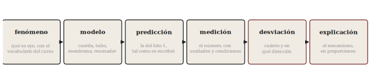

# Cómo defender un proyecto acústico

**Sesión 15** · Curso Acústica Musical UC
**Objetivos que cubre**: OA5.3 (explicar acústicamente el
comportamiento obtenido, incluidas las desviaciones), OA3.2 (conectar
sensación, mecanismo y medición en la defensa).

Este apunte es distinto a todos los anteriores: no trae física nueva,
porque la sesión 15 no la tiene. Trae el oficio que la sesión evalúa —
cómo se defiende un proyecto acústico — condensado para releerse la
noche anterior. La pauta completa del hito 3 (formato, tiempos y
rúbrica) está en [`sesiones/s14/actividades/pauta_hito3_presentacion_final.md`](../../s14/actividades/pauta_hito3_presentacion_final.md)
y se entregó impresa en la sesión 14; este apunte no la reemplaza:
explica cómo estar a su altura.

## ¿Qué se evalúa cuando ya está todo construido?

El instrumento ya existe; sonará lo que va a sonar. Lo único que queda
en juego el día de la presentación es la **explicación**, y esa es
precisamente la regla del curso desde el lanzamiento del proyecto en
la sesión 3: *la calidad de la explicación pesa más que el éxito
sonoro* (diseno/01, OA5.3 — regla heredada del curso 2019 y
conservada a propósito). Un objeto que hizo exactamente lo predicho,
presentado sin mecanismo, demuestra suerte. Un objeto que se desvió de
la predicción, con la desviación medida, explicada y conectada a un
modelo del curso, demuestra aprendizaje. La rúbrica está construida
para eso: su dimensión R1 (explicación acústica) desempata y manda.

## La columna vertebral de una buena explicación

Toda explicación acústica sólida — la de su proyecto y la de cualquier
artículo científico — recorre la misma cadena, en este orden:

**fenómeno → modelo → predicción → medición → desviación → explicación**

Primero el fenómeno: qué se oye, dicho con el vocabulario del curso
(no "suena raro": "el segundo parcial sobresale y el ataque es más
largo que el del hito 1"). Luego el modelo que ustedes eligieron para
pensarlo (cuerda, tubo, membrana, resonador) y la predicción que ese
modelo produjo — la del hito 1, citada tal como se escribió, sin
maquillaje retrospectivo. Después la medición: el número, con unidades
y condiciones. Y entonces el momento que separa una defensa buena de
una decorativa: la **desviación** — cuánto se apartó lo medido de lo
predicho, en qué dirección — y su explicación con mecanismo, en
proporciones ("la fundamental salió un 12 % más grave de lo predicho;
el modelo asumía el tubo abierto en ambos extremos, pero el soporte
tapa parcialmente uno: eso alarga el tubo efectivo y baja $f_1$").

Note que la cadena obliga a las tres capas del curso: el oído (el
fenómeno descrito), el mecanismo (modelo y explicación) y la medición
(el número que arbitra). Esa integración es exactamente OA3.2, y es lo
que las preguntas individuales van a sondear.

## Los errores clásicos (y cómo se ven desde la rúbrica)

**Contar lo que se hizo en vez de explicar por qué sonó como sonó.**
Es el error más frecuente: quince minutos de cronología ("primero
compramos el tubo, después lo cortamos, después...") sin un solo
mecanismo. La bitácora ya cuenta esa historia; la presentación debe
explicar el sonido. Regla práctica: si una lámina no responde a un
"¿por qué?", es bitácora, no defensa (R1 en nivel inicial: "narrativa
sin mecanismo físico").

**Esconder la desviación.** La tentación de mostrar solo lo que salió
bien es humana y es, en este curso, la peor estrategia posible: la
desviación explicada vale más que el éxito mudo, y la rúbrica lo dice
por escrito (R1 y R3 premian la desviación cuantificada y explicada;
R3 castiga la predicción "editada"). Si su instrumento hizo algo que
no esperaban, ese es el mejor material que tienen: pónganlo al centro.

**Figuras decorativas.** Un espectrograma proyectado que nadie lee no
es evidencia (R2: "mediciones presentes pero decorativas"). Cada
figura debe sostener una afirmación: dígala, apunte al eje, lea el
número. Y recuerde que cualquiera de los cuatro puede recibir la
pregunta "¿qué significa esta figura?" — el checklist de la pauta lo
advierte.

**El "porque sí" simétrico.** Tan débil como no explicar la desviación
es "explicar" el acierto sin mecanismo ("afinó bien porque lo hicimos
con cuidado"). El acierto también tiene física; si no puede decir cuál
es, la predicción se cumplió de casualidad y eso R1 lo nota.

## ¿Cómo responder una pregunta que no esperaba?

Las preguntas individuales (una por integrante, por nombre, sin ayuda
del grupo) no buscan pillarlo: buscan verificar que el proyecto es de
los cuatro. Tres reglas para responder bien:

Primero, **tómese cinco segundos**. Pensar antes de hablar no
descuenta; divagar, sí.

Segundo, **responda con la cadena**: qué se oye o se midió → qué
mecanismo lo explicaría → qué medición lo decidiría. Aunque no sepa la
respuesta completa, recorrer la cadena demuestra que sabe pensar el
problema — que es lo evaluado.

Tercero, distinga con honestidad **"no lo medimos"** de **"no se puede
saber"**. Son respuestas opuestas. "No lo medimos" es un dato honesto
y recuperable si continúa bien: *"...pero se mediría así, y si la
hipótesis es correcta debería dar aproximadamente esto"* — eso es un
nivel experto de la dimensión D3 que el curso entrena desde la semana
1. "No se puede saber", en cambio, es casi siempre falsa en este
curso: con un celular, un espectrograma y una regla se decide casi
todo lo que su instrumento hace. Úsela solo si de verdad puede
argumentar por qué ninguna medición factible discriminaría entre las
hipótesis — y eso, dicho bien, también vale puntos.

## Síntesis

- La explicación es la prueba: R1 manda, y la desviación explicada
  vale más que el éxito mudo.
- Toda la defensa recorre una sola cadena: fenómeno → modelo →
  predicción → medición → desviación → explicación.
- La cronología es bitácora; la defensa responde "¿por qué sonó así?".
- Ante una pregunta imprevista: cinco segundos, la cadena, y la
  diferencia honesta entre "no lo medí" y "no se puede saber".

## Hacia lo que sigue

No hay sesión 16. Lo que sigue es que usted ya no escucha igual: la
sesión cierra devolviéndole su hoja de línea base de la semana 1 para
que lo compruebe con sus propios ojos y oídos. El resto del arco — del
golpe de la sesión 1 a la sala de la 14 — está recapitulado en el
capítulo 15, que es también la mejor guía para preparar esta defensa.

## Referencias

- Pauta del hito 3: [`sesiones/s14/actividades/pauta_hito3_presentacion_final.md`](../../s14/actividades/pauta_hito3_presentacion_final.md)
  (formato, tiempos, rúbrica R1–R4, checklist).
- [`diseno/01_objetivos_aprendizaje.md`](../../../diseno/01_objetivos_aprendizaje.md), OA5.3 — la regla "la calidad
  de la explicación pesa más que el éxito sonoro".
- [`diseno/02_metodologia.md`](../../../diseno/02_metodologia.md), §4 — preguntas individuales y ajuste
  ±0,5 por coevaluación.
- El semestre completo: capítulos 1–14 del curso — cada modelo que su
  defensa necesite está en alguno de ellos.
